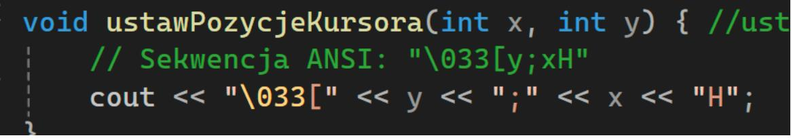
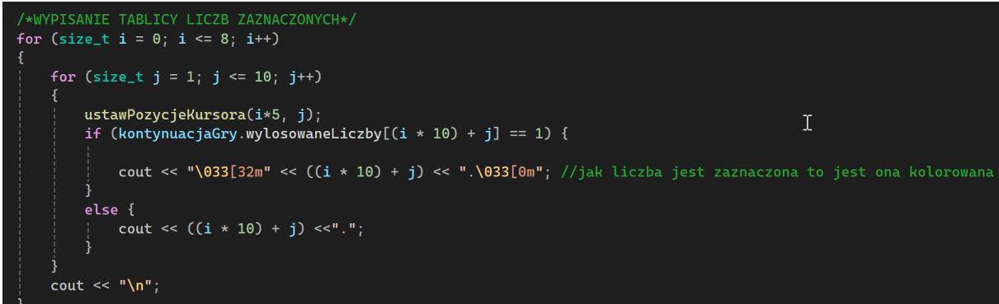

Politechnika Śląska, Wydział Matematyk Stosowanej, Kierunek Informatyka

Gliwice, 30.01.2025

Programowanie I **Projekt Zaliczeniowy "***Bingo***"**

**Mateusz Grabowski, gr. lab. 7**

# **1. Opis projektu.**

Projekt to implementacja znanej na całym świecie gry **Bingo**, napisanej w języku C++. Aplikacja umożliwia losowanie liczb zgodnie z zasadami Bingo, generowanie kart dla graczy oraz sprawdzanie wyników. Program wykorzystuje mechanizmy losowości, tablice do przechowywania siatek Bingo oraz podstawowe operacje wejścia/wyjścia do interakcji z użytkownikiem.

Program zapewnia wszystko co jest potrzebne do rozegrania gry. Użytkownik nie potrzebuje żadnych dodatkowych przedmiotów/programów, aby rozegrać grę przeciwko botom.

Kod jest napisany w sposób modułowy, co pozwala na jego łatwą rozbudowę, np. o tryb wieloosobowy czy dodatkowe warianty gry.

Rozgrywka nie ogranicza się jedynie do gry samemu. Dzięki zastosowanemu systemowi losowania liczb według seed'a, możliwe jest granie w trybie pseudowieloosobowym.

*Rys. 1: Ekran główny gry.*

# **2. Funkcjonalności.**

Projekt wykorzystuje znaczącą ilość metod przedstawionych na wykładach.

# **2.1 Generowanie kart Bingo**

Gracz i boty *(przeciwnicy)* dostają losowo wygenerowaną kartę Bingo, która jest tworzona według zasad:

- Plansza składa się z **5 kolumn i 5 wierszy**, a każda kolumna zawiera losowe liczby z określonych przedziałów:
	- o Pierwsza kolumna: (1–18)
- o Druga kolumna: (19–36)
- o Trzecia kolumna: (37–54),
- o Czwarta kolumna: (55–72)
- o Piąta kolumna: (73–90).
- Środkowe pole jest polem **"FREE"**, czyli automatycznie możliwym do zaznaczenia w dowolnej chwili.
- Każda karta jest zapisywana w pamięci programu i wyświetlana na ekranie w czytelny sposób.

*Rys. 2: Widok kart przeciwników*

#### **2.2 Losowanie liczb**

Gra losuje kolejne liczby z zakresu 1-90 w sposób unikalny (nie mogą się powtarzać w jednej rundzie). Losowanie jest obsługiwane przez moduł generowania liczb pseudolosowych. Wylosowane liczby stają się możliwe do zaznaczenia na kartach graczy.

*Rys. 3: Widok ekranu z wylosowaną liczbą*

# **2.3 Sprawdzanie zwycięzcy**

Po ogłoszeniu przez któregoś z graczy "Bingo", program weryfikuje, czy dany gracz spełnia warunki wygranej, czyli czy na jego karcie pojawiła się kompletna linia:

- **Pozioma** wszystkie pola w jednym wierszu są zakreślone.
- **Pionowa** wszystkie pola w jednej kolumnie są zakreślone.
- **Przekątna** ukośna linia (od lewego górnego do prawego dolnego rogu lub odwrotnie) jest zakreślona.

Jeżeli którykolwiek z tych warunków zostanie spełniony, a użytkownik zgłosi "Bingo" program ogłasza wygraną.

*Rys. 4: Zgłoszenie Bingo przez gracza*

# **2.4 Tryby gry**

Aplikacja obsługuje dwa tryby gry:

- Tryb jednoosobowy Użytkownik może wybrać ilość przeciwników na którą chciałby zagrać. Im więcej przeciwników, tym większa szansa, że któryś spełni warunki do ogłoszenia "Bingo", co powoduje zakończenie gry przegraną przez gracza.
- Tryb wieloosobowy Użytkownik może na dwóch klientach gry wpisać ten sam seed gry na ekranie ustawień. Powoduje to taką samą sekwencje losowych liczb, ale różne karty do gry. Dzięki synchronizacji przechodzenia do następnego losowania pomiędzy graczami możliwa jest gra o to, kto szybciej zgłosi Bingo na swoim kliencie.

*Rys. 5: Kod losowania liczb według seed'a*

### **2.5 Obsługa plików**

- Program może zapisywać wyniki graczy do pliku tekstowego, co umożliwia trwałe zapisanie najlepszych wyników.
- W menu istnieje możliwość wczytania z pliku listy 10 najlepszych graczy.

*Rys. 6: Ekran najwyższych wyników wczytany z pliku.*

### **2.6 Struktura kodu i podział na wiele plików**

| Plik              | Opis funkcjonalności                                                                                                               |
|-------------------|------------------------------------------------------------------------------------------------------------------------------------|
| ProjektBingo.cpp  | Miejsce wejścia programu, to tutaj znajduje się funkcja main(); która ustawia odpowiednie opcje konsoli i wywołuje menu główne. |
| Gra.cpp           | Obsługuje mechanikę gry: losowanie liczb, sprawdzanie warunków zwycięstwa, wyświetlanie wyników, wyświetlanie kart.             |
| Menu.cpp          | Zawiera menu gry, pozwalające wybrać tryb rozgrywki, przeczytać instrukcje lub zakończyć program.                            |
| Funkcje.cpp       | Implementuje funkcje pomocnicze, np. wyświetlanie liczb dużą czcionką lub obsługę przycisków z klawiatury.                   |
| Random.cpp        | Odpowiada za generowanie liczb losowych.                                                                                           |
| Przeciwnicy.cpp   | Zawiera funkcje wyświetlającą karty przeciwników na ekranie w celu ich sprawdzenia.                                             |
| ObslugaPlikow.cpp | Obsługuje zapis i odczyt danych z plików.                                                                                          |
| Header.h          | Plik nagłówkowy zawierający definicje struktur, stałych i funkcji używanych w programie.                                        |

# **3. Przebieg realizacji.**

Prace nad projektem rozpoczęły się od inspiracji, którą była gra Bloxy Bingo. Zacząłem od dokładnego poznania zasad gry w Bingo, oszacowania poziomu skomplikowania implementacji gry w C++ i zastanowienia się, czy za pomocą konsoli możliwe jest

odtworzenie angażującej rozgrywki. Podczas tworzenia gry starałem się stosować funkcje i biblioteki zaprezentowane podczas wykładów.

Same prace nad kodem rozpoczęły się 17 listopada 2024 od stworzenia menu głównego i funkcji losującej liczby. Ważnym punktem tego etapu było zabezpieczenie wszystkich wejść przed niewłaściwymi danymi *(np. zabezpieczenie przed wpisaniem znaku do zmiennej typu int).*

*Rys. 7: Kod menu głównego i zabezpieczenia przed błędami.*

Krytycznym momentem w trakcie tworzenia programu było poznanie sekwencji specjalnych ANSI, które umożliwiły czyszczenie całego ekranu, zmianę koloru tekstu, czy przesuwanie kursora. Sprawiło to, że menu zaczęło być bardziej czytelne, a na późniejszym etapie umożliwiło ustawienie elementów w odpowiednich miejscach. Kolory umożliwiły zakreślanie liczb i stworzenie kursora gracza. Kody ANSI umożliwiły też naprawienie problemu migającego ekranu, za pomocą przesuwania kursora i wypisywania tylko danych które się zmieniają, bez czyszczenia ekranu za każdym wywołaniem funkcji.

*Rys. 8: Funkcja wykorzystująca sekwencję ANSI.*

Następnie dodany został sam ekran gry. Powstała funkcja wypisująca listę wylosowanych liczb, liczba wylosowana w tym konkretnym losowaniu zostaje napisana dużą czcionką po prawej stronie ekranu, a na dole została dodana karta gracza.

*Rys. 9: Kod wypisania listy liczb na ekran.*

Nadszedł najwyższy moment, aby dodać elementy, które sprawią, że program będzie można nazwać grą. Została zaimplementowana funkcja wczytująca znaki z klawiatury użytkownika, która wykonuję konkretnie zadaną czynność. (np. strzałki przesuwają kursor po ekranie). Na tym etapie powstała też główna struktura, która przechowuje wszystkie informacje o karcie *(wylosowane numery; liczby, które zostały zakreślone; pozycje kursora; funkcje sprawdzającą bingo itp.)* Okazała się ona jednym z najważniejszych elementów obsługi mechaniki gry. Wprowadziłem możliwość zaznaczania numerów które zostały uprzednio wylosowane. Na tym etapie w grę można było grać samemu ze sobą.

*Rys. 10: Początek struktury KartaBingo.*

Aby zapewnić rywalizacje, na tym etapie zostali wprowadzeni przeciwnicy. Każdy z przeciwników (którzy są kontrolowani przez boty) otrzymuje kartę do gry w Bingo. Program sam zaznacza im wylosowane numery. Karty wrogów w każdym momencie można podglądnąć klikając klawisz "P" na klawiaturze. Zapewnia to transparentną rywalizacje i dreszczyk emocji, gdy widzimy, że jednemu z przeciwników brakuje tylko jednej liczby do ogłoszenia Bingo. Została wprowadzona sama możliwość zgłoszenia Bingo i skończenia gry.

*Rys. 11: Generowanie kart przeciwników, dynamiczna alokacja pamięci.*

Ostatnim etapem było wprowadzenie obsługi plików. Umożliwiło to trwałe zapisywanie najlepszych wyników i późniejsze ich wyświetlanie na ścianie chwały. Przy okazji została wprowadzona funkcja wykrywająca uszkodzenie pliku, która umożliwia zresetowanie jego zawartości w przypadku uszkodzenia formatu zapisywanych danych.

*Rys. 12: Funkcja czyszcząca plik w przypadku stwierdzenia uszkodzenia.*

Po przeprowadzeniu kilkunastu gier testowych i licznych testach w ekstremalnych warunkach stwierdziłem brak błędów skutkujących niemożliwością dalszej gry.

Ostateczna wersja gry zapewnia płynną, bezproblemową i przyjemną grę, a wygenerowani przeciwnicy umożliwili rywalizację i radość z wygranej.

### **4. Instrukcja użytkownika.**

Program po uruchomieniu wita nas menu głównym. Do wyboru mamy cztery opcje:

- Rozpoczęcie gry,
- Wyświetlenie instrukcji,
- Wyświetlenie top 10 wyników,
- Wyjście i zakończenie pracy programu.

*Rys. 13: Menu główne.*

Wybranie opcji nr 1 przenosi nas do ekranu ustawień w którym możemy wybrać seed, po którym losowana jest sekwencja liczb. Wpisanie tego samego seed'a na dwóch klientach umożliwia grę kilku osób. Sekwencja losowanych liczb będzie taka sama, natomiast liczby na kartach będą różne. Wystarczy, że gracze zsynchronizują przechodzenie do następnego losowania, i będą grać tak długo aż któryś z nich nie wygra. Na tym ekranie następuje również wybór ilości przeciwników. Im więcej przeciwników, tym gra jest trudniejsza, bo jest większe prawdopodobieństwo, że któryś z botów osiągnie warunki do ogłoszenia Bingo przed nami.

*Rys. 14: Ekran ustawień.*

### **4.1 Cel gry**

Celem gry jest zakreślenie określonego wzoru na swojej karcie Bingo poprzez zaznaczanie losowo wywoływanych numerów.

Wzory: Linia pozioma, linia pionowa, linia ukośna *(w każdej linii musi znajdować się 5 zakreślonych numerów, żeby zgłosić Bingo)*

### **4.2 Przebieg gry**

Program losuje numer, który zostaje ogłoszony graczom.

Gracz sprawdza swoją kartę. Jeśli dany numer znajduje się na karcie, zaznacza go.

Pierwszy gracz, który zaznaczy wymagany wzór, woła "Bingo!".

### **4.3 Warunki wygranej**

Gracz jako pierwszy musi zaznaczyć wymagany wzór i ogłosić Bingo.

Jeżeli przeciwnik jako pierwszy zawoła Bingo, wtedy następuje koniec gry i przegrana.

#### **4.4 Sterowanie**

Strzałki: Przesuwanie kursorem po karcie.

Enter: Zaznaczenie numeru *(da się go tylko zaznaczyć, jeżeli został wylosowany).*

Klawisz C: Przejście do następnego losowania.

Klawisz B: Ogłoś Bingo! (tylko jak spełnia się warunki do ogłoszenia Bingo).

Klawisz P: Pokaż karty przeciwników.

### **5. Podsumowanie i wnioski.**

Projekt gry w Bingo okazał się znacznie bardziej wymagającym przedsięwzięciem niż przypuszczałem. Realizacja go ukazała mi praktyczne zastosowania wskaźników i struktur w C++.

Stworzenie dobrze działających funkcji wymagało dużego wysiłku, aby wyobrazić sobie w jaki sposób zachowa się dana funkcja w takiej formie. Na praktycznym przykładzie mogłem doświadczyć jak ważna jest dynamiczna alokacja pamięci i jak istotnym elementem każdego bardziej skomplikowanego projektu są wskaźniki. Tworzenie przeciwników sprawiło, że musiałem zacząć myśleć wielozadaniowo. W danym momencie wykonywała się więcej niż jedna funkcja, co zmuszało do dokładniejszego przeanalizowania co się dzieje, w przypadku stwierdzenia problemu.

Jednym z najfajniejszych momentów tworzenia projektu było naprawianie błędów. Wymagało to wiele wysiłku, ale naprawienie nawet najmniejszego błędu wywoływało radość na twarzy. Odznaczenie jednego błędu na liście stanowiło rzeczywistą wizualizację postępów, jakie poczyniłem tworząc grę.

Dzięki temu projektowi poszerzyłem swoje umiejętności nie tylko kodowania, lecz też obsługi systemów kontroli wersji *(w moim przypadku GitHuba),* gdzie relacjonowałem wszystkie swoje postępy.

Uwaga – Program był testowany i tworzony na systemie Windows. Uruchomienie projektu na innym systemie może skutkować nieoczekiwanym zachowaniem. Podczas korzystania z Visual Studio wymagane jest ustawienie kodowania utf-8 w konsoli w celu poprawnego wyświetlania znaków. Instrukcja ustawienia kodowania w Visual Studio znajduje się na stronie Microsoftu. Link: [https://learn.microsoft.com/pl-pl/cpp/build/reference/utf-8-set-source-and](https://learn.microsoft.com/pl-pl/cpp/build/reference/utf-8-set-source-and-executable-character-sets-to-utf-8?view=msvc-170)[executable-character-sets-to-utf-8?view=msvc-170](https://learn.microsoft.com/pl-pl/cpp/build/reference/utf-8-set-source-and-executable-character-sets-to-utf-8?view=msvc-170)